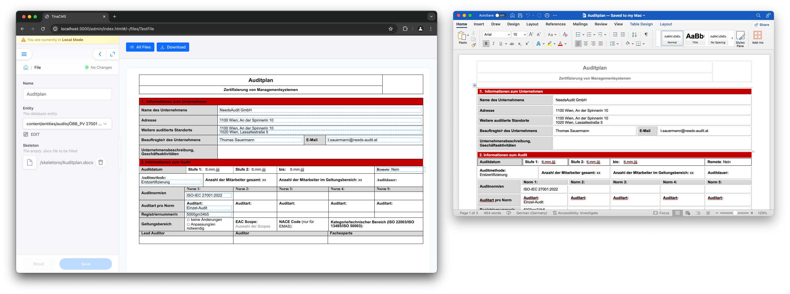

# Auditmanager

A NextJS application that aims to automatically fill .docx template files with content, either from a DB or an API. Add a template file, choose your entity to patch the file from, preview the patched file in the browser and download it.



## Get Started

Inside the project folder open a terminal and execute the following code to install it's dependencies and run the dev server:

```
npm install
npm run dev
```

Prepare the project for a deployment (with Vercel). Just add some environment variables:

```
TINA_TOKEN=<your value here>
NEXT_PUBLIC_TINA_CLIENT_ID=<your value here>

SUPABASE_URL=<your value here>
SUPABASE_KEY=<your value here>
```

More info here: [Going to Production with Tina Cloud](https://tina.io/docs/tina-cloud/overview/) and [Supabase Storage Quickstart](https://supabase.com/docs/guides/storage/quickstart)

## Used Libraries

Please consider a donation! Besides NextJS, this project leverages the following open source libraries:

- [tinacms](https://github.com/tinacms/tinacms): Visual editing and database
- [docxjs](https://github.com/dolanmiu/docx) Patching .docx files
- [mammoth](https://github.com/mwilliamson/mammoth.js): Converting .docx files to html
- [t3env](https://github.com/t3-oss/t3-env): For env checking
- [docx-preview](https://github.com/VolodymyrBaydalka/docxjs): Rendering a .docx preview in the browser

## FYI

If you want production tests to succeed, you have to disable Vercel's deployment protection. More info [here](https://github.com/patrickedqvist/wait-for-vercel-preview/issues/62). This shall be considered a temporary fix.